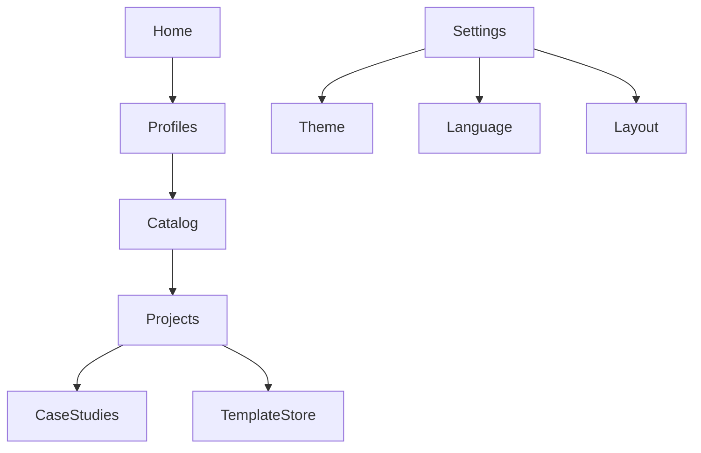

# 🎬 DOMFLIX

<p align="center">
  
</p>

<h1 align="center">DOMFLIX</h1>

<p align="center">
  Seu portfólio com experiência de streaming.
</p>
<p align="center">


</p>

---

# ✨ Visão Geral

O **DOMFLIX** é uma aplicação desenvolvida para transformar um portfólio tradicional em uma verdadeira plataforma de streaming de projetos.

Em vez de simplesmente listar trabalhos realizados, cada projeto é tratado como um "título" dentro de um catálogo, oferecendo uma experiência de navegação rica, intuitiva e visualmente envolvente.

O objetivo é unir:

* 🎯 Portfólio Profissional
* 📚 Documentação Técnica
* 💼 Case Studies
* 🛒 Marketplace de Templates
* 👤 Perfis Personalizados
* ⚙️ Configurações do Usuário

---

# 🎯 Objetivos

O DOMFLIX foi criado seguindo cinco pilares principais:

* Experiência semelhante à Netflix
* Arquitetura escalável
* Componentização reutilizável
* Performance
* Design consistente

---

# 🚀 Principais Recursos

## 🏠 Home

A porta de entrada da plataforma.

### Recursos

* Hero Banner
* Seleção de Perfis
* Continue Assistindo
* Destaques
* Conteúdo em Tendência
* CTA para Explorar o Catálogo

---

## 👤 Perfis

Cada usuário possui sua própria experiência.

### Recursos

* Grid de Perfis
* Avatar personalizado
* Criação de Perfil
* Edição de Perfil
* Exclusão
* Perfil Infantil (futuro)

---

## 🎞️ Catálogo

Centro de navegação do conteúdo.

### Recursos

* Categorias
* Filtros
* Pesquisa
* Ordenação
* Conteúdo em Destaque
* Rows horizontais
* Cards inteligentes

---

## 💼 Projetos

Apresentação detalhada dos projetos.

### Recursos

* Página exclusiva
* Tecnologias utilizadas
* Screenshots
* Links externos
* Demonstração
* Código-fonte
* Informações técnicas

---

## 📚 Case Studies

Documentação completa do desenvolvimento.

Cada projeto pode possuir:

* Timeline
* Processo de desenvolvimento
* Problemas encontrados
* Soluções adotadas
* Arquitetura
* Métricas
* Lições aprendidas

---

## 🛒 Template Store

Marketplace para comercialização de templates.

### Recursos

* Pricing Cards
* Demonstrações
* Recursos inclusos
* Download
* Integração com Gumroad

---

## ⚙️ Configurações

Preferências da plataforma.

### Recursos

* Tema Claro/Escuro
* Idioma
* Preferências de Layout
* Configurações de Conta

---

# 🏗️ Arquitetura

```
DOMFLIX
│
├── Home
├── Profiles
├── Catalog
├── Projects
├── Case Studies
├── Template Store
├── Settings
│
├── Shared
│
│   ├── Components
│   ├── Layouts
│   ├── Services
│   ├── Pipes
│   ├── Directives
│   └── Utilities
│
├── Core
│
│   ├── Guards
│   ├── Interceptors
│   ├── Authentication
│   ├── Firebase
│   └── API
│
└── Design System
    ├── Tokens
    ├── Colors
    ├── Typography
    ├── Spacing
    ├── Icons
    ├── Components
    └── Animations
```

---

# 🎨 Design System

Toda a interface utiliza um Design System próprio baseado em Design Tokens.

## Princípios

* Consistência visual
* Componentização
* Escalabilidade
* Responsividade
* Acessibilidade
* Reutilização

### Tokens

* Colors
* Typography
* Spacing
* Radius
* Shadows
* Motion
* Z-index
* Breakpoints

---

# 📊 Fluxo da Aplicação



---

# ⚙️ Stack Tecnológica

| Categoria      | Tecnologia              |
| -------------- | ----------------------- |
| Front-end      | Angular                 |
| Linguagem      | TypeScript              |
| Estilos        | SCSS                    |
| Backend        | Firebase                |
| Banco de Dados | Firestore               |
| Storage        | Firebase Storage        |
| Autenticação   | Firebase Authentication |
| Design System  | Próprio                 |
| Diagramas      | Mermaid                 |

---

# 📱 Responsividade

O DOMFLIX foi desenvolvido utilizando uma abordagem **Mobile First**, garantindo uma experiência consistente em diferentes dispositivos.

### Breakpoints

* 📱 Mobile
* 📲 Tablet
* 💻 Notebook
* 🖥️ Desktop
* 🖥️ Ultra Wide

---

# ✨ Diferenciais

* Interface inspirada na Netflix
* Componentização avançada
* Lazy Loading
* Arquitetura Modular
* Dark Mode
* Alta Performance
* Firebase Ready
* Código altamente reutilizável
* Escalável para novos módulos

---

# 📌 Roadmap

## ✅ Concluído

* Home
* Perfis
* Catálogo
* Projetos
* Case Studies
* Template Store
* Configurações

---

## 🚧 Em desenvolvimento

* Sistema de Autenticação
* Favoritos
* Busca Inteligente
* Dashboard Administrativo
* Analytics
* Comentários
* Avaliações
* Progressive Web App (PWA)

---

# 📂 Estrutura do Projeto

```
src/

├── app/
├── core/
├── shared/
├── layouts/
├── pages/
├── assets/
├── environments/
└── styles/
```

---

# 📄 Licença

Este projeto foi desenvolvido para fins de estudo, evolução técnica e demonstração de portfólio.

O DOMFLIX representa uma arquitetura moderna baseada em componentes reutilizáveis, Design System próprio e experiência inspirada nas principais plataformas de streaming.
