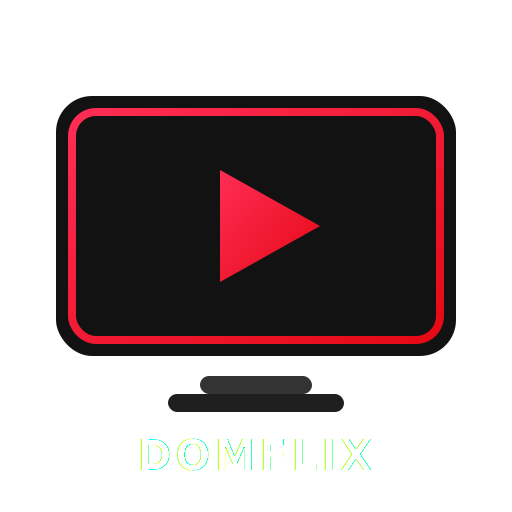

<h2 id="sobre-o-projeto">1. DOMFLIX - Plataforma de Streaming Moderna 🎬🍿</h2>




A **DOMFLIX** é uma plataforma de streaming desenvolvida para demonstrar técnicas modernas de desenvolvimento Front-end utilizando **Angular 20**, arquitetura **Standalone**, **Signals**, **Angular Material** e toda a infraestrutura do **Firebase**.

O objetivo do projeto é reproduzir uma experiência semelhante às principais plataformas de streaming do mercado, aplicando boas práticas de arquitetura, componentização, performance, responsividade e integração com serviços em nuvem.

Além do catálogo de filmes e séries, a aplicação possui autenticação, gerenciamento de usuários, persistência de dados, favoritos, sistema administrativo e uma arquitetura preparada para crescimento contínuo.

---

# 📚 Tabela de Conteúdo

| 💻 O Projeto | 🛠️ Técnico | 🤝 Comunidade |
| :---: | :---: | :---: |
| [](#sobre-o-projeto) | [](#destaques-tecnicos) | [](#codigo-fonte) |
| [](#tecnologias-utilizadas) | [](#fluxo-de-deploy) | [](#creditos) |
| [](#como-acessar) | [](#como-contribuir) | [](#licenca) |
| [](#funcionalidades) | [](#faq) | [](#perfil-do-github) |

---

<h2 id="tecnologias-utilizadas">2. ⚙️ Tecnologias Utilizadas</h2>

| Camada | Tecnologias | Descrição |
| :--- | :--- | :--- |
| **Framework** |  | Framework SPA moderno utilizando arquitetura Standalone. |
| **Linguagem** |  | Desenvolvimento totalmente tipado. |
| **UI** |  | Componentes Material Design. |
| **Styles** |  | Arquitetura modular de estilos. |
| **Estado** |  | Gerenciamento reativo moderno. |
| **Backend** |  | Authentication, Firestore, Storage e Hosting. |
| **CI/CD** |  | Build e Deploy automatizados. |

---

<h2 id="como-acessar">3. 🚀 Como Acessar</h2>

Assim que publicado, o projeto poderá ser acessado através do Firebase Hosting.
<div align="left">
  <a href="https://github.com/Domisnnet/Domflix-Angular" target="_blank">
    
  </a>
</div>

---

<h2 id="funcionalidades">4. 🧩 Funcionalidades Principais</h2>

| Funcionalidade | Descrição |
| :--- | :--- |
| 🎬 Catálogo Inteligente | Organização dinâmica de filmes e séries. |
| 🔎 Pesquisa Instantânea | Busca rápida utilizando filtros e categorias. |
| ❤️ Minha Lista | Favoritos sincronizados com Firebase. |
| ▶ Continue Assistindo | Histórico persistido em nuvem. |
| 👤 Autenticação | Login utilizando Firebase Authentication. |
| 🎭 Perfis | Gerenciamento de usuários. |
| 📱 Layout Responsivo | Desktop, Tablet e Mobile. |
| 🌙 Dark Theme | Interface inspirada nas principais plataformas de streaming. |
| ⚡ Lazy Loading | Carregamento sob demanda. |
| 📈 Alta Performance | Arquitetura otimizada utilizando Angular 20 e Signals. |

---

<h2 id="destaques-tecnicos">5. 💻 Destaques Técnicos</h2>

### 🎯 Arquitetura Standalone Angular 20

A DOMFLIX foi construída utilizando a arquitetura **Standalone Components**, eliminando completamente a necessidade de **NgModules**. Essa abordagem reduz a complexidade do projeto, melhora o carregamento das rotas e facilita a manutenção do código.
Cada funcionalidade da aplicação possui sua própria estrutura de componentes, serviços e modelos, tornando o desenvolvimento muito mais organizado e escalável.

---

### ⚡ Angular Signals

O gerenciamento de estado utiliza **Signals**, tecnologia oficial do Angular para reatividade.
Entre as principais vantagens estão:

- Atualizações automáticas da interface.
- Menor consumo de memória.
- Código mais limpo.
- Melhor desempenho que abordagens tradicionais.

---

### 🔥 Firebase como Backend

Toda a infraestrutura da aplicação está centralizada no Firebase.
Serviços utilizados:

| Serviço | Finalidade |
| :--- | :--- |
| Firebase Authentication | Login e autenticação |
| Cloud Firestore | Banco de dados |
| Firebase Storage | Imagens e mídias |
| Firebase Hosting | Hospedagem |
| Analytics | Monitoramento |
| Cloud Functions | Recursos futuros |

---

### 🧱 Arquitetura Feature First

O projeto segue organização por funcionalidades.
```text
src/
├── app/
│   ├── core/
│   ├── features/
│   ├── shared/
└── assets/
```
Essa organização facilita o crescimento da aplicação conforme novos módulos são adicionados.

---

### 🎨 Design System

A interface foi construída utilizando:
- Angular Material
- SCSS Modular
- Variáveis globais
- Mixins reutilizáveis
- Responsividade Mobile First
Todo o sistema visual mantém consistência entre componentes e facilita futuras evoluções.

---

<h2 id="fluxo-de-deploy">6. 📦 Fluxo de Deploy</h2>

O deploy da aplicação utiliza Firebase Hosting integrado ao GitHub.
Para publicar uma nova versão basta executar:
```bash
ng build --configuration production
```
Em seguida:
```bash
firebase deploy
```
---

### 🔄 Pipeline CI/CD

Cada atualização enviada para a branch principal pode executar automaticamente:
- Instalação das dependências
- Build Angular
- Testes
- Deploy Firebase
- Atualização do ambiente de produção
Esse fluxo reduz erros manuais e mantém a aplicação sempre atualizada.

---

<h2 id="como-contribuir">7. 🤝 Como Contribuir</h2>

Siga os passos abaixo para fortalecer este projeto e sugerir melhorias:

| Fase | Ação | Link / Comando |
| :---: | :--- | :--- |
| **01** | **Fork** | [](https://github.com/Domisnnet/Domflix-Angular/fork) |
| **02** | **Branch** | `git checkout -b feature/MinhaMelhoria` |
| **03** | **Commit** | `git commit -m 'feat: add nova seção de projetos'` |
| **04** | **Push** | `git push origin feature/MinhaMelhoria` |
| **05** | **PR** | [](https://github.com/Domisnnet/Domflix-Angular/compare)

### 🐛 Encontrou um problema?
Se algo não estiver funcionando como esperado, não hesite em abrir um chamado:

[](https://github.com/Domisnnet/Domflix-Angular/issues)
[](https://github.com/Domisnnet/Domflix-Angular/issues/new)


---

<h2 id="faq">8. 🧠 Perguntas Frequentes</h2>

<details>
<summary><strong>Por que Angular Standalone ao invés de NgModules ❓</strong></summary>
O Angular moderno recomenda Standalone Components por simplificar a arquitetura, melhorar o Lazy Loading e reduzir dependências entre módulos.
</details>

<details>
<summary><strong>Por que utilizar Firebase ❓</strong></summary>
O Firebase oferece autenticação, banco de dados, armazenamento e hospedagem em uma única plataforma totalmente integrada ao Angular.
</details>

<details>
<summary><strong>A aplicação utiliza Signals ❓</strong></summary>
Sim.
Grande parte do gerenciamento de estado utiliza Angular Signals para garantir maior desempenho e código mais limpo.
</details>

<details>
<summary><strong>O projeto é responsivo ❓</strong></summary>
Sim.
Toda a interface foi desenvolvida utilizando abordagem Mobile First, adaptando automaticamente o layout para smartphones, tablets e desktops.
</details>

<details>
<summary><strong>Existe autenticação ❓</strong></summary>
Sim.
A autenticação utiliza Firebase Authentication, permitindo login seguro e gerenciamento de usuários.
</details>

---

<h2 id="codigo-fonte">9. 💻 Código Fonte</h2>

Explore toda a arquitetura da DOMFLIX através do repositório oficial no GitHub.


[](https://github.com/Domisnnet/Domflix-Angular)

---

## 📂 Organização do Projeto

A estrutura segue o conceito **Feature First**, permitindo que cada funcionalidade evolua de maneira independente.
```text
src
├── app
│   ├── core
│   │   ├── guards
│   │   ├── interceptors
│   │   ├── layouts
│   │   └── services
│   ├── shared
│   │   ├── components
│   │   ├── directives
│   │   ├── interfaces
│   │   ├── models
│   │   └── pipes
│   ├── features
│   │   ├── auth
│   │   ├── home
│   │   ├── catalog
│   │   ├── categories
│   │   ├── movie
│   │   ├── player
│   │   ├── favorites
│   │   ├── profile
│   │   └── admin
│   └── app.routes.ts
├── assets
└── environments
```
Essa arquitetura facilita a escalabilidade da aplicação, melhora a manutenção do código e reduz o acoplamento entre funcionalidades.

---

## 🧱 Princípios Utilizados
✔ Componentização
✔ SOLID
✔ DRY
✔ Clean Code
✔ Lazy Loading
✔ Standalone Components
✔ Signals
✔ Mobile First
✔ Feature First
✔ Design System
✔ Firebase Cloud
✔ CI/CD

---

<h2 id="creditos">10. 📝 Créditos & Reconhecimentos</h2>

| Atribuição | Responsável | Descrição |
| :--- | :--- | :--- |
| **Arquitetura Front-end** | **DomisDev** | Estrutura completa da aplicação Angular. |
| **UI / UX** | **DomisDev** | Desenvolvimento da identidade visual inspirada em plataformas de streaming. |
| **Infraestrutura Cloud** | **Google Firebase** | Authentication, Firestore, Storage, Hosting e Analytics. |
| **Angular Material** | **Google Angular Team** | Biblioteca oficial de componentes Material Design. |
| **Documentação Técnica** | **DomisDev** | Organização e padronização do projeto seguindo o padrão King-Domfy. |

---

## 🙏 Agradecimentos

Este projeto representa uma evolução significativa da minha jornada como Desenvolvedor Front-end.
Cada componente foi desenvolvido buscando:
- Código limpo
- Alta performance
- Escalabilidade
- Organização
- Boas práticas
- Experiência moderna para o usuário

---

<h2 id="licenca">11. 📄 Licença</h2>

Este projeto está sob a [](https://github.com/Domisnnet/Domflix-Angular/blob/main/LICENSE)

---

<h2 id="perfil-do-github">12. 👨‍💻 Perfil do GitHub / Autor</h2>

## 🚀 Sobre o Autor

Desenvolvedor especializado em aplicações Front-end modernas utilizando Angular.
### Stack Principal
- Angular
- TypeScript
- SCSS
- Firebase
- Angular Material
- Git
- GitHub
- CI/CD
- UX/UI

---

### 📬 Contato

Caso queira conversar sobre desenvolvimento Front-end, Angular ou oportunidades profissionais:
- GitHub
- LinkedIn
- Portfólio
- E-mail

---

# ⭐ Se este projeto foi útil para você...

Considere deixar uma ⭐ no repositório.
Esse pequeno gesto ajuda na divulgação do projeto e incentiva o desenvolvimento de novas funcionalidades.
Obrigado por visitar a DOMFLIX!
🍿🎬

<a href="https://github.com/Domisnnet"> 
   
</a>